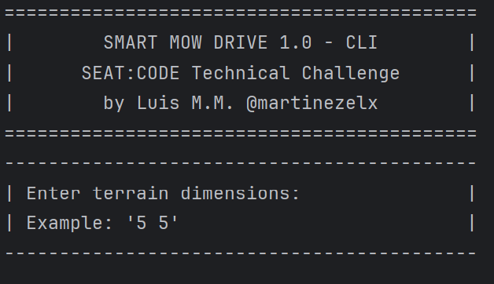
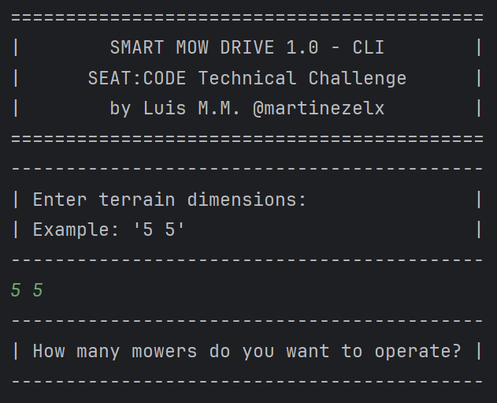
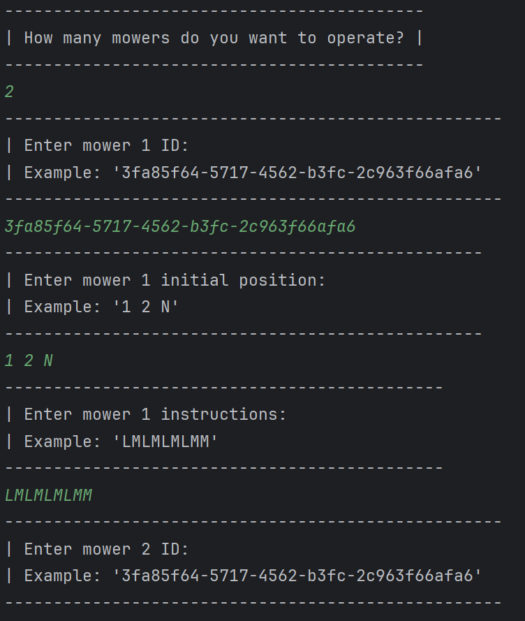

# Smart-Mow-Drive | SEAT:CODE Backend Challenge

## Description
- This project is a solution to the SEAT:CODE Backend Challenge. The goal of this challenge is to develop an application that allows the user to define the mowing area and set detailed instructions for each mower's path and actions. The application must ensure efficient navigation and obstacle avoidance through advanced instruction processing, enabling mowers to adapt to diverse lawn configurations dynamically. The application must also provide a REST API and a CLI for interacting with the system.
- The instructions and rules of the challenge can be found in the following [link](./readme-resources/docs/mobility_SEAT_CODE_backend_code_challenge.pdf)

## Tech Stack
- IDE: IntelliJ IDEA Community Edition (2023.3)
- Java: 21.0.1 OpenJDK
- Spring Boot: 3.2.1
     - Spring DevTools
     - Spring Web
     - Spring Actuator
     - Spring Validation
- Lombok: 1.18.30
- SpringDoc OpenApi: 2.3.0
- Maven: 3.9.2

## Versions
### v1.0.0
- Initial application launch.
### v1.1.0
- CLI bug fixes: Fixed the problem that did not correctly display the positions of the mowers when completing the execution of the instructions in the CLI.
- Improved code documentation: Add versions in README and upgrade correctly the pom.
- Improved code: Some method refactoring names to improve the readability of the code.
- Add actuator timed: Add actuator timed to measure the time of the execution of the instructions.
- Add logs: Add more logs to facilitate the debugging of the application.
- Add docs: Add pdf with the code challenge description.
### v1.2.0
- Update Spring Boot to 3.2.1.
- Update SpringDoc OpenApi to 2.3.0.
- Improved code: Refactor the tests to improve the readability of the code and add more tests.
- Improved readme: Fix markdowns.
### v1.3.0
- Update README.
- Improved code: Refactor the CLI to improve the readability of the code.

## Prerequisites to test/run the application
- Java: 21.0.1 - [Download](https://openjdk.org/projects/jdk/21/)
- Maven: 3.9.2 - [Download](https://maven.apache.org/download.cgi)

## Decisions made
### Adopting Hexagonal Architecture
- We opted for a Hexagonal Architecture to clearly separate the core business logic from the infrastructure layer. This approach enhances maintainability and scalability, allowing independent evolution of the business logic and external components.
### Choosing Java 21
- Java 21, being the latest Long-Term Support (LTS) version, was selected as the programming language for this project. This choice allows us to leverage the newest features and improvements in the Java language, ensuring modern practices and efficient performance.
### Choosing Spring Boot 3.2.0
- Spring Boot 3.2.0 was chosen for its extensive set of features that significantly simplify the development and deployment of web applications. Its auto-configuration capabilities, along with a wide array of starter kits, allow for rapid development and easy integration of various components. Spring Boot 3.2.0 also aligns well with our use of Java 21, supporting and enhancing the latest features of the language.
### Using Lombok to Reduce Boilerplate
- Lombok was used to reduce boilerplate code and improve the readability of the application. By eliminating the need for repetitive code, Lombok allows developers to focus on the core business logic, resulting in a cleaner and more concise codebase.
### Using SpringDoc OpenApi to Document the API
- SpringDoc OpenApi was used to document the API. This library provides a simple and straightforward way to generate OpenAPI documentation for Spring Boot applications. By leveraging the annotations provided by SpringDoc OpenApi, we can easily document the API and keep the documentation in sync with the codebase.
### Using Spring Actuator to Monitor the Application
- Spring Actuator was used to monitor the application. This library provides a simple and straightforward way to monitor the application's health, metrics, and other useful information. By leveraging the endpoints provided by Spring Actuator, we can easily monitor the application and keep track of its performance.
### Employing Records in Domain Layer
- In the domain layer of our architecture, Java Records are utilized to encapsulate the state and behavior of business entities. This choice underscores our commitment to immutability and clarity within our domain logic. Records provide a succinct and expressive approach to defining our models, significantly reducing the boilerplate often associated with traditional Java POJOs. By leveraging records, we ensure that domain objects are thread-safe and maintain a consistent state, facilitating a more reliable and predictable flow of data towards the application layer.
### Implementing GlobalExceptionHandler
- A GlobalExceptionHandler is utilized to handle exceptions at a global level within the application. By propagating domain exceptions to the application layer and centralizing error handling, we eliminate the need for repetitive try/catch blocks in services. This strategy not only simplifies the codebase but also ensures consistent error handling across the application.
### Use of functional programming
- Functional programming is used to simplify the code and make it more readable. This approach allows us to focus on the core business logic, resulting in a cleaner and more concise codebase.
### Focusing on Clean and Maintainable Code
- Throughout the development process, a strong emphasis was placed on writing clean, well-documented, and maintainable code. This approach not only makes future modifications and extensions more manageable but also ensures that the application adheres to industry best practices.

## Utilizing Spring Profiles for Flexible Configuration
- Spring Profiles provide a powerful and flexible way to segregate parts of our application configuration, making them only available in certain environments. In our application, we have leveraged this feature to control the activation of the Command Line Interface (CLI) and the REST API.
- We have defined two profiles: "cli" and "rest". The "cli" profile activates the CLI part of the application, while the "rest" profile activates the REST API.
### CLI Profile
- The CLI profile is activated by adding `cli` to the `spring.profiles.active` property in the `application.properties` file or by passing it as a command line argument when starting the application:
```properties
spring.profiles.active=cli
```
```shell
./mvnw spring-boot:run -Dspring-boot.run.profiles=cli
``` 
### REST Profile
- The REST profile is activated by adding `rest` to the `spring.profiles.active` property in the `application.properties` file or by passing it as a command line argument when starting the application:
```properties
spring.profiles.active=rest
```
```shell 
./mvnw spring-boot:run -Dspring-boot.run.profiles=rest
```
### Activating Multiple Profiles
- It's also possible to activate multiple profiles at the same time. For instance, if you want to have both the CLI and REST parts of your application active, you can do so by listing them in the spring.profiles.active property, separated by commas:
```properties
spring.profiles.active=cli,rest
```
- This flexible configuration allows us to control which parts of our application are active based on the environment or the specific needs of our application at runtime.

## To improve
### Implementing Database for Data Persistence
- We plan to integrate an H2 database for persisting data, which will enhance our application's data management capabilities. This improvement is aimed at providing robust data storage and retrieval, facilitating more complex functionalities and user interactions. Additionally, we will focus on implementing comprehensive integration tests to ensure the reliability and stability of the database interactions.
### Considering Advanced Mapping Solutions
- As our application evolves, we are open to adopting more powerful mapping tools like MapStruct, particularly if the API expands significantly. For now, Spring's built-in type conversion is sufficient, but we recognize the potential need for a more sophisticated mapping solution as the complexity of data transformations increases. MapStruct would offer greater efficiency and cleaner code for complex mapping scenarios, making it a valuable addition for future scalability.
### Emphasizing Continuous Improvement
- We are committed to continuously improving our application, keeping an eye on emerging technologies and methodologies that could further enhance performance, usability, and maintainability. By staying adaptable and responsive to new challenges, we aim to keep our application at the forefront of technological advancements.
### Implementing a CI/CD Pipeline
- We plan to implement a CI/CD pipeline to automate the build and deployment process. This improvement will allow us to streamline the development process, ensuring that the application is always in a deployable state. Additionally, we will focus on implementing comprehensive integration tests to ensure the reliability and stability of the CI/CD pipeline.
### Deploying the Application in Cloud Services
- We plan to deploy the application in cloud services to ensure that the application is always available. This improvement will allow us to have a more reliable and stable application. Additionally, we will focus on implementing comprehensive integration tests to ensure the reliability and stability of the cloud services.
### Improve the code
- We plan to improve the code by refactoring it to follow the best practices and design patterns. This improvement will allow us to have a more maintainable and scalable codebase. Additionally, we will focus on implementing SOLID rules and the application of Domain Drive Design pattern (DDD).
### Improve the tests
- We plan to improve the tests by adding more unit tests, integration tests and CLI tests. This improvement will allow us to have a more reliable and stable codebase. Additionally, the tests needs a review and the addition of new cases to cover all possible combinations.

## Run tests
You can use your favorite IDE to run the tests or use the following command:
```shell
mvn test
```

## Run the application
1. Clone the repository
2. In the cloned folder repository, run the following command:
```shell
mvn spring-boot:run
```

## Validations
> [!WARNING]
> If the JSON payload is not correct, the application will return a 400 Bad Request specifying the error.
### Terrain dimensions
- The terrain dimensions must be a string with two positive integers separated by a space.
- The first integer represents the width of the terrain.
- The second integer represents the height of the terrain.
```json
{"terrainDimensions": "5 5"}
```
### ID
- The ID must be a string with a valid UUID.
- The ID must be unique.
```json
{"id": "3fa85f64-5717-4562-b3fc-2c963f66afa6"}
```
### Starting position
- The starting position must be a string with three parts separated by a space.
- The first part represents the starting position of the mower, x and y.
- The second part represents the orientation N|S|E|W.
```json
{"startingPosition": "1 2 N"}
```
> [!CAUTION]
> If a mower's starting position coincides with the final position of a previously moved mower, the application will return an error.
### Instructions
- The instructions must be a string with a combination of the following letters: L|R|M.
- L: Rotate the mower 90 degrees to the left.
- R: Rotate the mower 90 degrees to the right.
- M: Move the mower forward one space.
```json
{"instructions": "LMLMLMLMM"}
```

## Available endpoints
Since the project uses SpringDoc OpenApi, we can see the available endpoints at the following link:
[http://localhost:8080/swagger-ui/index.html](http://localhost:8080/swagger-ui/index.html)
### Examples to call the endpoints
You can use the HTTP client of your choice to call the endpoints. In the next examples I will use Postman to perform the requests.
Using the [import feature of Postman](https://learning.postman.com/docs/getting-started/importing-and-exporting-data/) you can import the OpenAPI definition from the following link: [http://localhost:8080/v3/api-docs](http://localhost:8080/v3/api-docs)
#### Execute the instructions to move a mowers
- `POST /api/v1/mower/process-instructions`
#### Example with a successful response:
- Request:
```json
{
  "terrainDimensions": "5 5",
  "mowersInstructions": [
    {
      "id": "3fa85f64-5717-4562-b3fc-2c963f66afa6",
      "startingPosition": "1 2 N",
      "instructions": "LMLMLMLMM"
    },
    {
      "id": "3fa85f64-5717-4562-b3fc-2c963f66afa6",
      "startingPosition": "3 3 E",
      "instructions": "MMRMMRMRRM"
    }
  ]
}
```
- Response:
```json
[
  {
    "x": 1,
    "y": 3,
    "position": "N",
    "status": "Instructions executed successfully"
  },
  {
    "x": 5,
    "y": 1,
    "position": "E",
    "status": "Instructions executed successfully"
  }
]
```
#### Example with an error response:
- Request:
```json
{
  "terrainDimensions": "5 5",
  "mowersInstructions": [
    {
      "id": "3fa85f64-5717-4562-b3fc-2c963f66afa1",
      "startingPosition": "1 2 N",
      "instructions": "LMLMLMLMM"
    },
    {
      "id": "3fa85f64-5717-4562-b3fc-2c963f66afa2",
      "startingPosition": "3 3 E",
      "instructions": "MMRMMRMRRM"
    },
    {
      "id": "3fa85f64-5717-4562-b3fc-2c963f66afa3",
      "startingPosition": "1 4 N",
      "instructions": "LMLMLMLMM"
    }
  ]
}
```
- Response:
```json
[
  {
    "x": 1,
    "y": 3,
    "position": "N",
    "status": "Instructions executed successfully"
  },
  {
    "x": 5,
    "y": 1,
    "position": "E",
    "status": "Instructions executed successfully"
  },
  {
    "x": 0,
    "y": 3,
    "position": "E",
    "status": "Error executing instructions, the mower has been stopped at the last valid position, see the log for more details"
  }
]
```
> [!TIP]
> You can review the performance of this endpoint in the following link: http://localhost:8080/actuator/metrics/mower.process.instructions
#### Example of performance metrics:
- Response:
```json
[
  {
    "name": "mower.process.instructions",
    "description": "Time taken to process mower instructions",
    "baseUnit": "seconds",
    "measurements": [
      {
        "statistic": "COUNT",
        "value": 2.0
      },
      {
        "statistic": "TOTAL_TIME",
        "value": 0.025113
      },
      {
        "statistic": "MAX",
        "value": 0.0224056
      }
    ],
    "availableTags": [
      {
        "tag": "exception",
        "values": [
          "none"
        ]
      },
      {
        "tag": "method",
        "values": [
          "processInstructions"
        ]
      },
      {
        "tag": "class",
        "values": [
          "com.smartmowdrive.application.rest.MowerController"
        ]
      }
    ]
  }
]
```

## CLI example
- The CLI is a simple command line interface that allows you to interact with the application.
- The CLI is only available when the `cli` profile is active.
### Screenshots
- 
- 
- 
- 
- 
> [!NOTE]
> The cli shows a drawing of the terrain and where each mower ends, as well as its orientation.
